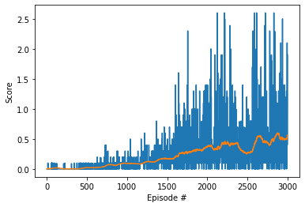

# report

With project recomendation i start coping DDPG-pendulum files and MADDPG - Lab files, then the first change is in model where i change state size and action size.

After i implement all code by traing an Agent for check if input and output was correct.

The number of nodes in hidden layers (h1, h2) was find by test with (384, 288) and (192, 144) nodes where (384, 288) nodes have best score by the graph.

The batch_size as seted considering enverinmont timestamp ~ 15, then considering 10 episodes the batch_size value is 150.

The seed as seted trying best score in 1000 episodes, in the test with (0, 4, 5, 6, 10) the seed = 5 have best results.

this graph show average score for episode.

For future i would like to try use monte carlo tree search and prioritized experience replay